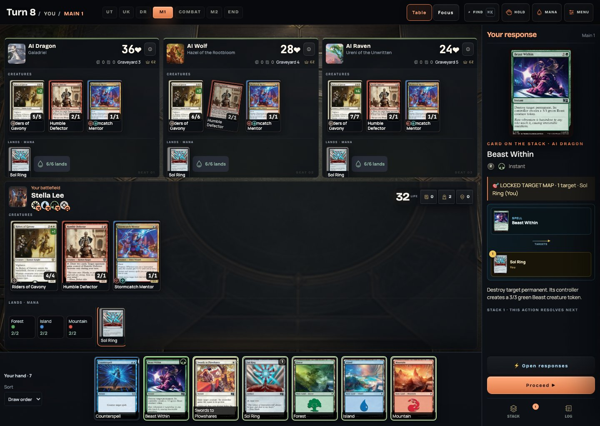

# Commander Simulator

A browser Commander table with local AI opponents, private multiplayer, animated commanders, and your own imported decks. Pick one of 27 ready-to-play precon decks or bring a supported list, choose the personalities around the table, and play through the stack, priority, combat, triggered abilities, and optional political negotiations at your own pace.

**[Play Commander Simulator](https://mtg-commander-simulator.vercel.app/)** · [Import a deck](docs/deck-import.md) · [Card catalog](docs/card-catalog.md) · [Deployment](docs/deployment.md)



**Explore:** [Game modes](#what-you-can-play) · [Precons and commander videos](#27-precon-decks-and-commander-video-animations) · [First game](#your-first-game) · [Deck import](#import-your-deck) · [AI and Command Zone styles](#ai-archetypes-and-custom-skills) · [Diplomacy & Politics](#diplomacy--politics) · [Run locally](#run-locally) · [Hosting and Live](#vercel-and-multiplayer) · [Saves and help](#saves-privacy-and-troubleshooting) · [Current limits](#current-limits)

## What you can play

| Mode | How it works |
| --- | --- |
| Solo | Control one seat against one to three local AI opponents. Choose decks, opponent styles, difficulty, and optional Politics rules. No model API or AI subscription is required. |
| Commander Live | Invite friends to a private table of two to four human players. The host runs the game engine; the room server synchronizes decisions and sends each guest their own view. Keep the host's game tab open. |
| Imported decks | Paste a Commander decklist, check it against the supported catalog, and save it to My Library. Ready lists can be used by you, Solo opponents, and Live players. |

There are **27 built-in 100-card decks**. As of **5 September 2026**, the engine catalog contains **19,484 card definitions**, of which **19,438 are eligible for deck import**. These figures describe this repository's supported catalog, not every Magic card. The [generated inventory and remaining-card lists](docs/card-catalog.md) are authoritative for later imports and record exact names, eligibility, and the source snapshot used for comparison.

Accounts are optional. Guests can play immediately and retain imported lists in their current browser. Signing in adds a private Solo checkpoint, synced imported decks and favorites, lifetime statistics, and recent match results. Custom AI skills and saved pod presets remain local to the browser.

## 27 precon decks and commander video animations

The built-in library contains **27 precon decks, each with 100 cards and commander video coverage**. Choose a deck to open its **Deck Spotlight**: a commander preview, color identity, strategy, pace and complexity, mana curve, card-type breakdown, key cards, opening-hand advice, and a route through the early, middle, and late game. You can keep browsing before committing to a pod.

**There are 28 dedicated commander videos across the 27 decks.** Turtle Power has two default partner commanders, **Leonardo, the Balance** and **Michelangelo, the Heart**, and each has its own clip. Every other deck's default commander also has a dedicated animation.

- **In Deck Spotlight:** the commander video plays as a muted, looping preview alongside the card art and deck guide.
- **On battlefield entry:** in the Solo arena and Live host view, a supported precon commander receives a short **COMMANDER ENTERS** video announcement. This happens when the commander reaches the battlefield, so putting a spell on the Stack does not by itself trigger the entrance. The announcement has a **Skip** button and closes automatically. Remote Live guests use the synchronized card-based view without these entry clips.
- **Playback:** the MP4 clips are bundled with the game, play muted and inline, and are cosmetic; they do not change mana, priority, card abilities, or the result of a spell. The battlefield announcement uses card art if playback fails or Reduced motion is enabled.
- **Imported decks:** use ordinary commander card art and a battlefield highlight. They do not inherit a precon's cinematic, even when they use the same commander. Video coverage refers to the predefined decks' default commanders, not every alternate commander in the catalog.

<details>
<summary>Explore all 27 precon decks and their animated default commanders</summary>

| Built-in deck | Default commander(s) |
| --- | --- |
| Abzan Armor | Felothar the Steadfast |
| Animated Army | Bello, Bard of the Brambles |
| Avengers Assemble | Captain America, Team Leader |
| Blight Curse | Auntie Ool, Cursewretch |
| Counter Intelligence | Inspirit, Flagship Vessel |
| Deep Clue Sea | Morska, Undersea Sleuth |
| Doom Prevails | Doctor Doom, King of Latveria |
| Elven Council | Galadriel, Elven-Queen |
| Endless Punishment | Valgavoth, Harrower of Souls |
| Family Matters | Zinnia, Valley's Voice |
| Mardu Surge | Zurgo Stormrender |
| Most Wanted | Olivia, Opulent Outlaw |
| Prismari Artistry | Rootha, Mastering the Moment |
| Quick Draw | Stella Lee, Wild Card |
| Squirreled Away | Hazel of the Rootbloom |
| The Fantastic Four | Invisible Woman |
| Turtle Power | Leonardo, the Balance + Michelangelo, the Heart |
| Wakanda Forever | T'Challa, the Black Panther |
| Scions & Spellcraft | Y'shtola, Night's Blessed |
| Coven Counters | Leinore, Autumn Sovereign |
| Quandrix Unlimited | Zimone, Infinite Analyst |
| Dance of the Elements | Ashling, the Limitless |
| World Shaper | Hearthhull, the Worldseed |
| Limit Break | Cloud, Ex-SOLDIER |
| Temur Roar | Ureni of the Unwritten |
| Sultai Arisen | Teval, the Balanced Scale |
| Jeskai Striker | Shiko and Narset, Unified |

</details>

## Your first game

1. Open the game and choose **Start a solo table**, or open **Guide** for a walkthrough.
2. Select a built-in deck or a ready list in **My Library**. Its deck overview explains the game plan and card composition.
3. Continue to **Pod**, choose opponents and settings, and review the table before starting.
4. Keep or mulligan your opening hand. Use the available action buttons to play lands, cast spells, activate abilities, and pass priority.
5. **HOLD** arms a stop at the next priority window; **Proceed** advances a presented action or review. Important spells and combat decisions wait for your input. Click controls remain available alongside optional drag controls.

The arena includes card inspection, searchable zones, a game log, combat assignments, priority settings, and desktop/mobile table views. Optional Last Resort/Judge controls and Politics house rules are explained in the game; their use can change a match beyond ordinary automated rules handling.

Solo players and Live hosts use the **Command Table** interface. **Table** shows the opponents together; **Focus** gives a selected opponent more room. The decision panel keeps the current action visible, and target/combat choices reveal the relevant players. Live guests use the separate remote player view. The landing-page Table/Focus preview shows screenshots of the interface; it does not start a game.

## Import your deck

Build or edit your list in a deck builder such as Moxfield, then copy its **plain-text export**. On the home screen, choose **Import your decklist here**, paste the list, and press **Check decklist**. Once validation passes, choose **Save to My Library** and select the saved deck to continue through Deck → Pod → Review.

The list must contain 100 cards including the commander or legal commander pair, and satisfy the engine's commander, color-identity, singleton, and card-support checks. Unknown, ineligible, or unsupported cards are reported before play; importing text does not implement new cards. The player UI accepts decklist text, not a Moxfield URL.

See [the complete import guide](docs/deck-import.md) for accepted formats, paired commanders, library persistence, Live sharing, and error recovery. Maintainer Oracle batch imports are a separate process described in the [catalog guide](docs/card-catalog.md).

## AI archetypes and custom skills

The **Commander AI Engine V2** uses deterministic local heuristics and bounded search. It combines a deck's strategic profile with an opponent style, difficulty, legal actions, and the visible multiplayer threat picture. It receives a restricted player view; it does not consult an external model service.

### Build a pod with distinct opponents

In **Solo → Pod**, choose one to three opponents and set each seat's **Deck** and **Play style** separately. Bots can pilot a built-in precon or a supported imported list from My Library. The deck supplies the cards and strategic opportunities; the style changes how the bot values those opportunities. **Advanced rules → Difficulty** selects Easy, Normal, or Hard, changing search effort and decision tolerance without granting extra cards, mana, or access to opponents' hidden hands.

For example, you can give the same deck to an Aggressive and a Defensive opponent to compare how they use it, or mix three different decks and personalities. **Random style** assigns a built-in personality revealed during play; your installed custom skills do not enter that random pool.

### Core archetypes

| Style | What to expect at the table |
| --- | --- |
| **Aggressive** | Builds attackers, applies early pressure, and hunts wounded opponents. Prefers keeping its attackers over making defensive trades. |
| **Opportunist** | Looks for exposed or weakened players, preserves a useful attack, and avoids unnecessary confrontation with the strongest seat. |
| **Defensive** | Develops resources, keeps blockers, values protection, and waits for a worthwhile attack. |
| **Saboteur** | Disrupts other players' plans, redirects pressure, and values political or goad effects when its cards actually provide them. |
| **Balanced** | Weighs development, combat, safety, and interaction without one of the stronger core tilts. |

### Command Zone signature styles

The **Command Zone signatures** group offers five more detailed personalities inspired by public Commander play. Each has its own development priorities, situational behavior, and preferences for political deals. These are implemented game policies, not exact recreations of real people or an affiliation with The Command Zone. Their portraits and short reactions identify the chosen style; the reactions are game-written flavor text.

| Signature style | Game plan | Political preference |
| --- | --- | --- |
| **[Jimmy — Aggressive Pressure](docs/jimmy-aggro-pressure-research.md)** | Develop the commander and supporting board, attack open lanes, then switch from steady pressure to a race or a decisive all-out attack. Protect a promising winning line. | Accept a temporary reprieve when it creates room to apply pressure; preserve the route to its own win. |
| **[Rachel — Balanced Tablecraft](docs/rachel-balanced-tablecraft-research.md)** | Build flexible value, read threats across the whole table, keep defensive answers, and recover or finish when the position calls for it. | Address shared threats and make room for development; judge an offer in the context of the whole board. |
| **[Post Malone — Opportunist Showstopper](docs/post-malone-opportunist-research.md)** | Accumulate cards while keeping a low profile, use theft/copy opportunities supplied by the deck, take calculated risks, and turn the setup into a strong finish. | Favor survival deals and useful cooperation against a shared threat while keeping future opportunities open. |
| **[Olivia — Saboteur Instigator](docs/olivia-saboteur-instigator-research.md)** | Probe safe attacks, misdirect pressure, disrupt the public leader, and exploit an opening with a calculated ambush. | Favor precise short deals, pressure the shared threat, and look for ways to weaken opposing cooperation. |
| **[Josh — Defensive Value](docs/josh-value-engine-research.md)** | Develop mana and repeatable card advantage, preserve interaction, put shields up under threat, and convert a stronger resource position into a win. | Favor exact, short exchanges and cooperation against a shared threat. |

These preferences rank **legal actions available in the current game**. An aggressive bot still has survival checks; a theft-focused style cannot steal a permanent without a suitable card; a political style cannot force another player to accept an offer. All five operate within the same agreement rules when [Diplomacy & Politics](#diplomacy--politics) is enabled. They can also be used with Politics off. Commander Live is human-only, so these opponent styles are Solo features.

### Add your own AI skill

1. Open **Solo → Pod → Upload / manage custom AI skills**.
2. Download the JSON template, or copy the creation prompt and describe the opponent you want to an assistant of your choice.
3. Upload or paste the completed JSON and choose **Check skill**.
4. Review the validated settings and choose **Save skill**.
5. Select the saved entry under **Your custom skills** for an opponent, then continue to Review.

Skills use the **`commander-ai-skill/v1`** declarative JSON format. They can build on a core or signature style and tune supported preferences for resources, combat, interaction, and card roles. Uploaded JavaScript and free-form instructions are not executed. Saving a skill does not automatically assign it to a bot; the library holds up to 20 skills in the current browser, and JSON export lets you back them up or share them.

- [Archetypes, signature styles, and deck plans](docs/ai-archetypes.md)
- [Custom skill format, examples, validation, and installation](docs/custom-ai-skills.md)
- [AI architecture and decision pipeline](docs/COMMANDER_AI_ENGINE.md)

## Diplomacy & Politics

**Diplomacy & Politics** adds structured, public agreements to Solo Commander. You can negotiate with bots, receive their offers or counteroffers, and watch bots negotiate with each other. Accepted terms affect the actions a player may voluntarily take, and the table keeps a visible record of proposals and active agreements.

### Enable negotiations and make an offer

1. Build a Solo pod with **at least two AI opponents**: negotiations need three or four active players.
2. In **Pod → Advanced rules**, enable **Diplomacy & Politics** and confirm the setting in Review. It is off by default and is disabled in Commander Live.
3. Ordinary negotiations unlock once every active player has **started their third turn**. Open **Deals**, the mobile **Politics** control, or **Game Menu → Diplomacy & Politics** to see the unlock status, incoming offers, agreements, and recent table negotiations.
4. Choose **Make offer** beside an opponent. Select a concrete request and a concrete promise in return; the composer offers terms that can be measured against the current board.
5. Read the response. A bot can accept, decline, or return a counteroffer. A counteroffer is a new proposal requiring your decision, not an automatic acceptance of revised terms.

The normal offer allowance is **two proposals per table round**, with at most one to the same opponent. Repeating a rejected offer without a meaningful board change is blocked. Ordinary diplomacy ends when only two players remain.

### What a deal can promise

| Promise | What it actually covers |
| --- | --- |
| **Do not attack** | The promising player's next combat against the named player. It is not an indefinite alliance. |
| **Do not harmfully target a player or their permanents** | Voluntary harmful target choices through the promising player's next turn. It does not grant protection from every effect that can affect the board. |
| **Leave a named permanent alone** | Harmful targeting of that specific permanent through the promising player's next turn. |
| **Let a spell resolve** | The promising player will not counter or harmfully target that specific object on the Stack. Other players can still respond, and the spell still follows its ordinary resolution rules. |
| **Pressure the runaway threat** | Make a tactically sound attack on the identified leader during the next combat, if such an attack remains available. An attack that simply loses an attacker to a free block does not count as a useful opportunity. |

A typical exchange is: **“Do not attack me in your next combat; in return, I will not harmfully target your named engine through my next turn.”** The game evaluates the actual board and the scope of both promises. A harmless-looking promise is not automatically equivalent to a valuable protection clause; a bot can reject an unequal exchange.

### Read every negotiation before play continues

Negotiations **pause the game for human review**, including your outgoing offer's result and bot-to-bot deals. When an offer is addressed to you, choose **Accept offer**, **Accept counteroffer**, or **Decline**. For a completed negotiation or a deal between bots, review the terms and click **Proceed**. There is no response timer, and bots do not advance the game while that review is pending.

The Politics panel separates **Awaiting your decision**, **Active agreements**, and **Recent table negotiations**. Follow the named players, target, and expiry on each term rather than assuming a deal protects you for the rest of the match. Successful agreements can improve rapport, but the AI still evaluates its own survival and winning chances.

### Table deals, Last Stand, and public votes

- **Three-player table removal:** with four players still alive, three nonleaders can coordinate an answer to the runaway leader's named nonland permanent. One player announces an available removal spell and target; the other two offer short protection in return. The removal player must still pay for and cast the spell. That promise is fulfilled by casting it at the agreed target, so a later counterspell or changed game state can still prevent the removal from succeeding.
- **Last Stand:** after the ordinary unlock, a player facing imminent elimination on the public board can ask for amnesty through the rescuer's next turn in exchange for a larger commitment. Options include a two-turn pledge not to attack or harmfully target the rescuer or their permanents, sacrificing a named eligible permanent during the endangered player's next turn's end step, or attacking the runaway threat during the next two combats whenever a sound attack exists. Last Stand allows two requests per table round, at most one per opponent, separately from the two ordinary offers. A runaway leader cannot use it, and acceptance is not guaranteed. A tribute means sacrificing the specified permanent, not giving its control to the other player.
- **Public vote bargains:** supported public voting effects can offer a short promise in return for a specific vote. These contextual campaigns can appear **before the ordinary third-round unlock** when Politics is enabled. Accepting commits that public vote; declining leaves it free. The campaign also commits its sponsor's vote and can secure at most one other player's ballot. For effects using the campaign tie-break—**Galadriel, Elven-Queen**, **Sail into the West**, and **Plea for Power**—an option backed by the sponsor and that secured voter can win a tie. The counts remain unchanged: a 2–2 vote still records 2–2. This is an optional Politics house rule that can change those cards' voting outcomes; other voting effects apply their own result rules.

### How agreements interact with Magic rules

Ordinary agreements are short and specific. There are no permanent alliances, secret-vote bargains, open-ended favors, or promises to concede. The engine rejects conflicting or one-sided commitments, restricts buying protection for a runaway leader, and limits simultaneous combat-immunity agreements. The displayed **Reciprocity Check** is an estimate of benefit, cost, and promise scope, not a currency or a reward paid to a player.

Accepted terms constrain voluntary attacks and harmful target choices. Mandatory Magic actions can override an impossible promise without blame, and terms expire or become void when their conditions no longer apply. A no-targeting deal does not stop a nontargeted board wipe merely because it would affect a protected permanent. **Politics is an optional house-rule layer**; leave it off for games without enforced negotiation contracts or campaign tie-breaks. Printed voting mechanics on supported cards still work with Politics off.

## Run locally

Requirements: **Node.js 22+**, npm, and Python 3 for the static preview command.

```bash
git clone https://github.com/tuitamogamer-gpt/mtg-commander-simulator.git
cd mtg-commander-simulator
npm ci
npm run serve
```

Open <http://127.0.0.1:8000>. This starts a static preview for guest Solo play. It does not start the account or multiplayer APIs; those need the server setup in [Deployment and multiplayer operations](docs/deployment.md).

The frontend uses native browser ES modules and bundled data. There is no production frontend build step. Card art for the built-in decks is bundled locally; other catalog cards and unresolved alternate prints can use Scryfall image endpoints, with a card-back fallback. Imported decks can therefore need network access for artwork. `npm run sync:card-images` is the explicit image-maintenance command.

## How the application works

| Area | Main files | Responsibility |
| --- | --- | --- |
| Public entry | `index.html`, `src/public-entry.js`, `src/modules/landing.js` | Landing page, interface preview, and guide; load the heavy game modules when needed. |
| Rules and table | `src/modules/engine2.js`, `src/modules/ui.js`, `src/modules/main.js` | Legal decisions, stack resolution, combat, setup, and game presentation. |
| Command Table | `src/modules/command-table.js`, `src/command-table.css`, `src/command-landing.css` | Table/Focus presentation, player seats, decision panel, and matching landing design. |
| Card data | `src/data.js`, `src/modules/oracle-catalog.js`, `src/oracle-batches/` | Built-in decks, card definitions, Oracle batches, and catalog metadata. |
| Deck import | `src/modules/deck-import.js` | Parse and validate lists; manage saved deck records. |
| Local AI | `src/modules/ai-*`, `src/modules/ai-skill-ui.js` | Deck strategy, decisions, and custom skill workshop. |
| Live rooms | `api/ws.js`, `logic.js`, `src/modules/multiplayer.js` | WebSocket connections, Redis room state, seat/action checks, and guest views. |
| Accounts | `api/account.js` | Sessions, imported libraries, favorites, private Solo saves, and statistics. |

In Solo, the browser owns the complete rules engine. In Live, the host browser owns it and publishes per-player projections through the room service. This is a **trusted-host private-table model**: the server validates room roles and decision contracts, but does not independently simulate every game rule or prevent a modified host from cheating.

## Vercel and multiplayer

The existing production project serves the static client and the APIs from the same origin. `vercel.json` defines security/cache headers and a 300-second duration for `api/ws.js`; the client reconnects its socket when necessary.

Live room storage needs server-only `REDIS_URL`, `KV_URL`, or `UPSTASH_REDIS_URL`. Accounts use the REST pair `KV_REST_API_URL` / `KV_REST_API_TOKEN`, or `UPSTASH_REDIS_REST_URL` / `UPSTASH_REDIS_REST_TOKEN`. A Redis TCP URL and Redis REST credentials serve different integrations. Configure both for a deployment that offers Live and accounts.

See [Deployment](docs/deployment.md) for exact commands, environment variables, custom domains, room expiry, local integration testing, and production checks. Never commit `.env` files, Redis credentials, cookies, or private room invitations.

## Saves, privacy, and troubleshooting

**Save & Continue** stores one private Solo checkpoint per signed-in account. A finished Solo win awards 100 lifetime points; a completed loss awards 25. Match recording is idempotent. Live uses room reconnection and synchronization instead of the Solo save format, and does not support moving a running game to another host.

**Game Menu → Download debug snapshot** exports a share-safe `mtg-commander-debug/v1` report with the seed, public state, recent public log, and AI decisions. **Import debug snapshot** restores the setup and starts a deterministic game from turn one; it does not restore a midgame private save. Online snapshots are not accepted by the Solo replay importer.

Read [Data and account behavior](docs/data-and-accounts.md) before choosing what to save or share. For a rules/UI bug, [open an issue](https://github.com/tuitamogamer-gpt/mtg-commander-simulator/issues) with the card names, expected and actual behavior, browser, steps to reproduce, and a share-safe debug report when available. Remove personal information from screenshots and never post private save files or room links.

## Verification and release

```bash
npm run check
npm test
npm run audit
npm run certify:strict
```

Focused AI and server checks are available as `npm run test:ai` and `npm run test:server`; `npm run benchmark:ai` measures the AI workload. The [release guide](PUBLIC_RELEASE.md) covers browser gameplay, multiplayer privacy/reconnection, account checks, remote commit parity, and deployment verification. Certification is executable project coverage, not proof of every possible card interaction.

To generate a portable self-host archive:

```bash
npm run package:public
```

The archive is `dist/commander-simulator-public.zip`. It includes the client, local artwork, source, tests, reports, and server modules. Redis configuration and an appropriate server host are still required for online features.

## Current limits

- Only cards accepted by the catalog and deck validator can be imported. New sets and unsupported mechanics require implementation and verification.
- Live is invite-only, human-only, and requires a trusted host whose game tab stays open. There is no public matchmaking, host migration, or durable midgame Live restore.
- Browser-local guest lists, skills, and pod presets do not automatically follow you to another device or domain.
- Account password reset/change, email verification, and self-service account deletion are not implemented. See [account behavior](docs/data-and-accounts.md) for current retention and recovery limits.
- Passing tests covers the documented scenarios; a large imported catalog does not establish exhaustive multiplayer interaction coverage.

## Fan project notice

Commander Simulator is unofficial Fan Content permitted under the [Wizards Fan Content Policy](https://company.wizards.com/en/legal/fancontentpolicy). Not approved/endorsed by Wizards. Portions of the materials used are property of Wizards of the Coast. ©Wizards of the Coast LLC.
