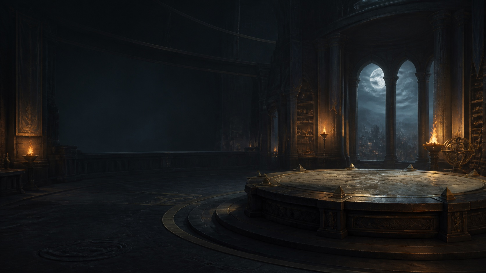

# Commander Simulator

A browser Commander table with local AI opponents, private multiplayer, and your own imported decks. Pick a deck, build a pod, review the settings, and play through the stack, priority, combat, and triggered abilities at your own pace.

**[Play Commander Simulator](https://mtg-commander-simulator.vercel.app/)** · [Import a deck](docs/deck-import.md) · [Card catalog](docs/card-catalog.md) · [Deployment](docs/deployment.md)



## What you can play

| Mode | How it works |
| --- | --- |
| Solo | Control one seat against one to three local AI opponents. Choose decks, opponent styles, difficulty, and optional Politics rules. No model API or AI subscription is required. |
| Commander Live | Invite friends to a private table of two to four human players. The host runs the game engine; the room server synchronizes decisions and sends each guest their own view. Keep the host's game tab open. |
| Imported decks | Paste a Commander decklist, check it against the supported catalog, and save it to My Library. Ready lists can be used by you, Solo opponents, and Live players. |

There are **27 built-in 100-card decks**. As of **5 September 2026**, the engine catalog contains **19,484 card definitions**, of which **19,438 are eligible for deck import**. These figures describe this repository's supported catalog, not every Magic card. The [generated inventory and remaining-card lists](docs/card-catalog.md) are authoritative for later imports and record exact names, eligibility, and the source snapshot used for comparison.

Accounts are optional. Guests can play immediately and retain imported lists in their current browser. Signing in adds a private Solo checkpoint, synced imported decks and favorites, lifetime statistics, and recent match results. Custom AI skills and saved pod presets remain local to the browser.

## Your first game

1. Open the game and choose **Start a solo table**, or open **Guide** for a walkthrough.
2. Select a built-in deck or a ready list in **My Library**. Its deck overview explains the game plan and card composition.
3. Continue to **Pod**, choose opponents and settings, and review the table before starting.
4. Keep or mulligan your opening hand. Use the available action buttons to play lands, cast spells, activate abilities, and pass priority.
5. **HOLD** arms a stop at the next priority window; **Proceed** advances a presented action or review. Important spells and combat decisions wait for your input. Click controls remain available alongside optional drag controls.

The arena includes card inspection, searchable zones, a game log, combat assignments, priority settings, and desktop/mobile table views. Optional Last Resort/Judge controls and Politics house rules are explained in the game; their use can change a match beyond ordinary automated rules handling.

## Import your deck

Build or edit your list in a deck builder such as Moxfield, then copy its **plain-text export**. On the home screen, choose **Import your decklist here**, paste the list, and press **Check decklist**. Once validation passes, choose **Save to My Library** and select the saved deck to continue through Deck → Pod → Review.

The list must contain 100 cards including the commander or legal commander pair, and satisfy the engine's commander, color-identity, singleton, and card-support checks. Unknown, ineligible, or unsupported cards are reported before play; importing text does not implement new cards. The player UI accepts decklist text, not a Moxfield URL.

See [the complete import guide](docs/deck-import.md) for accepted formats, paired commanders, library persistence, Live sharing, and error recovery. Maintainer Oracle batch imports are a separate process described in the [catalog guide](docs/card-catalog.md).

## AI archetypes and custom skills

The **Commander AI Engine V2** uses deterministic local heuristics and bounded search. It combines a deck's strategic profile with an opponent style, difficulty, legal actions, and the visible multiplayer threat picture. It receives a restricted player view; it does not consult an external model service.

Choose an opponent archetype in **Solo → Pod**. For your own style, open **Upload / manage custom AI skills**, download the supplied JSON template or copy the creation prompt, validate your file, save it, and explicitly select it for an opponent. Skills are bounded declarative JSON profiles; uploaded JavaScript is not executed.

- [Archetypes, signature styles, and deck plans](docs/ai-archetypes.md)
- [Custom skill format, examples, validation, and installation](docs/custom-ai-skills.md)
- [AI architecture and decision pipeline](docs/COMMANDER_AI_ENGINE.md)

## Run locally

Requirements: **Node.js 22+**, npm, and Python 3 for the static preview command.

```bash
git clone https://github.com/tuitamogamer-gpt/mtg-commander-simulator.git
cd mtg-commander-simulator
npm ci
npm run serve
```

Open <http://127.0.0.1:8000>. This starts a static preview for guest Solo play. It does not start the account or multiplayer APIs; those need the server setup in [Deployment and multiplayer operations](docs/deployment.md).

The frontend uses native browser ES modules and bundled data. There is no production frontend build step. Card art for the built-in decks is bundled locally; other catalog cards and unresolved alternate prints can use Scryfall image endpoints, with a card-back fallback. Imported decks can therefore need network access for artwork. `npm run sync:card-images` is the explicit image-maintenance command.

## How the application works

| Area | Main files | Responsibility |
| --- | --- | --- |
| Public entry | `index.html`, `src/public-entry.js` | Landing page and guide; load the heavy game modules when needed. |
| Rules and table | `src/modules/engine2.js`, `src/modules/ui.js`, `src/modules/main.js` | Legal decisions, stack resolution, combat, setup, and game presentation. |
| Card data | `src/data.js`, `src/modules/oracle-catalog.js`, `src/oracle-batches/` | Built-in decks, card definitions, Oracle batches, and catalog metadata. |
| Deck import | `src/modules/deck-import.js` | Parse and validate lists; manage saved deck records. |
| Local AI | `src/modules/ai-*`, `src/modules/ai-skill-ui.js` | Deck strategy, decisions, and custom skill workshop. |
| Live rooms | `api/ws.js`, `logic.js`, `src/modules/multiplayer.js` | WebSocket connections, Redis room state, seat/action checks, and guest views. |
| Accounts | `api/account.js` | Sessions, imported libraries, favorites, private Solo saves, and statistics. |

In Solo, the browser owns the complete rules engine. In Live, the host browser owns it and publishes per-player projections through the room service. This is a **trusted-host private-table model**: the server validates room roles and decision contracts, but does not independently simulate every game rule or prevent a modified host from cheating.

## Vercel and multiplayer

The existing production project serves the static client and the APIs from the same origin. `vercel.json` defines security/cache headers and a 300-second duration for `api/ws.js`; the client reconnects its socket when necessary.

Live room storage needs server-only `REDIS_URL`, `KV_URL`, or `UPSTASH_REDIS_URL`. Accounts use the REST pair `KV_REST_API_URL` / `KV_REST_API_TOKEN`, or `UPSTASH_REDIS_REST_URL` / `UPSTASH_REDIS_REST_TOKEN`. A Redis TCP URL and Redis REST credentials serve different integrations. Configure both for a deployment that offers Live and accounts.

See [Deployment](docs/deployment.md) for exact commands, environment variables, custom domains, room expiry, local integration testing, and production checks. Never commit `.env` files, Redis credentials, cookies, or private room invitations.

## Saves, privacy, and troubleshooting

**Save & Continue** stores one private Solo checkpoint per signed-in account. A finished Solo win awards 100 lifetime points; a completed loss awards 25. Match recording is idempotent. Live uses room reconnection and synchronization instead of the Solo save format, and does not support moving a running game to another host.

**Game Menu → Download debug snapshot** exports a share-safe `mtg-commander-debug/v1` report with the seed, public state, recent public log, and AI decisions. **Import debug snapshot** restores the setup and starts a deterministic game from turn one; it does not restore a midgame private save. Online snapshots are not accepted by the Solo replay importer.

Read [Data and account behavior](docs/data-and-accounts.md) before choosing what to save or share. For a rules/UI bug, [open an issue](https://github.com/tuitamogamer-gpt/mtg-commander-simulator/issues) with the card names, expected and actual behavior, browser, steps to reproduce, and a share-safe debug report when available. Remove personal information from screenshots and never post private save files or room links.

## Verification and release

```bash
npm run check
npm test
npm run audit
npm run certify:strict
```

Focused AI and server checks are available as `npm run test:ai` and `npm run test:server`; `npm run benchmark:ai` measures the AI workload. The [release guide](PUBLIC_RELEASE.md) covers browser gameplay, multiplayer privacy/reconnection, account checks, remote commit parity, and deployment verification. Certification is executable project coverage, not proof of every possible card interaction.

To generate a portable self-host archive:

```bash
npm run package:public
```

The archive is `dist/commander-simulator-public.zip`. It includes the client, local artwork, source, tests, reports, and server modules. Redis configuration and an appropriate server host are still required for online features.

## Current limits

- Only cards accepted by the catalog and deck validator can be imported. New sets and unsupported mechanics require implementation and verification.
- Live is invite-only, human-only, and requires a trusted host whose game tab stays open. There is no public matchmaking, host migration, or durable midgame Live restore.
- Browser-local guest lists, skills, and pod presets do not automatically follow you to another device or domain.
- Account password reset/change, email verification, and self-service account deletion are not implemented. See [account behavior](docs/data-and-accounts.md) for current retention and recovery limits.
- Passing tests covers the documented scenarios; a large imported catalog does not establish exhaustive multiplayer interaction coverage.

## Fan project notice

Commander Simulator is unofficial Fan Content permitted under the [Wizards Fan Content Policy](https://company.wizards.com/en/legal/fancontentpolicy). Not approved/endorsed by Wizards. Portions of the materials used are property of Wizards of the Coast. ©Wizards of the Coast LLC.
