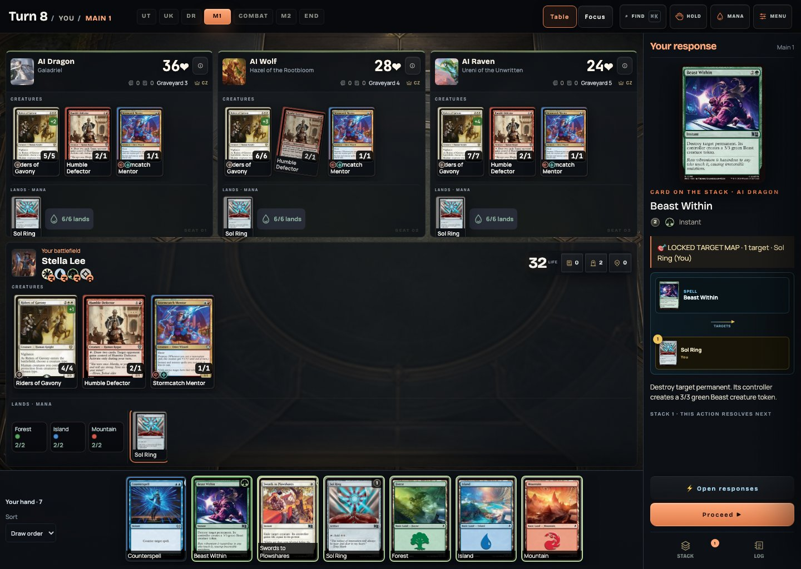
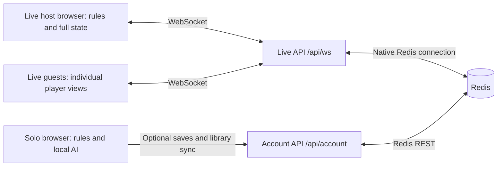

# Commander Simulator

**Play Magic: The Gathering Commander in your browser, with local AI opponents or friends at a private table.**

Choose a ready-to-play precon or import your own supported deck. Build a pod, pick opponent personalities, and play through casting, priority, the stack, combat, and triggered abilities at your own pace. Solo AI runs on your device and needs no model API key or AI subscription.

**[Play now](https://mtgpod.xyz/)** · [Import a deck](docs/deck-import.md) · [Card catalog](docs/card-catalog.md) · [Report a bug](https://github.com/tuitamogamer-gpt/mtg-commander-simulator/issues)



> **Development focus:** Solo play against local AI. Commander Live with human players is currently in testing.
>
> **Napomena:** Multiplayer mod sa živim igračem je trenutno u testnoj fazi. Molim za strpljenje. Kompletna pažnja je posvećena isključivo borbi protiv AI protivnika.

## Start playing

1. [Open Commander Simulator](https://mtgpod.xyz/) in a current desktop, tablet, or mobile browser. Guest Solo needs no account or installation.
2. Choose **Play solo**, select a deck, and set up one to three AI opponents in **Pod**.
3. Review the settings, keep or mulligan your opening hand, and follow the available actions. Open **Guide** if this is your first visit.

For friends, choose **Play with friends** to open Commander Live and invite them to a private two-to-four-player table. Keep the host's game tab open for the whole match. For your own list, open **My Library** and paste a plain-text deck export under **Import your decklist here**.

**Developers:** jump to [Run locally](#run-locally). **iPhone & iPad:** use the browser or build the [iOS app project](#iphone-and-ipad-app) on a Mac.

## Explore this guide

| For players | For developers and maintainers |
| --- | --- |
| [Modes and card coverage](#what-you-can-play) | [Local setup: Windows, macOS, Linux](#run-locally) |
| [All precons and commander videos](#175-precon-decks-and-commander-video-animations) | [Application architecture](#how-the-application-works) |
| [First game, combat, mobile controls, and audio](#your-first-game) | [Vercel and multiplayer](#vercel-and-multiplayer) |
| [Automatic and manual mana](#automatic-and-manual-mana) · [Deck import](#import-your-deck) | [iPhone and iPad app](#iphone-and-ipad-app) |
| [AI styles and custom skills](#ai-archetypes-and-custom-skills) · [Politics](#diplomacy--politics) | [Tests and release checks](#verification-and-release) |
| [Judge and recovery](#judge-and-last-resort-recovery) · [Saves and troubleshooting](#saves-privacy-and-troubleshooting) | [Contributing](#contributing) · [Documentation index](#documentation-index) |
| [Current limits](#current-limits) | [Import history](#catalog-and-import-history) · [Credits](#ai-tools-used-for-this-project) |

## What you can play

| Mode | How it works |
| --- | --- |
| Solo | Control one seat against one to three local AI opponents. Choose decks, opponent styles, difficulty, and optional Politics rules. No model API or AI subscription is required. |
| Commander Live | Invite friends to a private table of two to four seats; the host can fill empty seats with local AI bots. The host runs the game engine; the room server synchronizes decisions and sends each guest their own view. Keep the host's game tab open. |
| Imported decks | Paste a Commander decklist, check it against the supported catalog, and save it to My Library. Ready lists can be used by you, Solo opponents, and Live players. |

### Current catalog

Repository inventory checked on **8 October 2026**:

| Measure | Available |
| --- | ---: |
| Built-in precon decks | **175**, each with 100 cards |
| Runtime card definitions | **29,799** |
| Definitions eligible for deck import | **29,798** |
| Generic Oracle batches | **258**, containing 25,800 definitions |
| Dedicated commander videos | **28**, across the original 27 decks |

These counts describe the implemented catalog, not every Magic card or every possible rules interaction. **Brisela, Voice of Nightmares** is a meld result and cannot be imported as a standalone card. Some original precon lists retain cards regardless of banlist status; acceptance by this simulator is not a current tournament-legality check.

Browse the [supported-card CSV](docs/catalog/imported-cards.csv), [remaining-card CSV](docs/catalog/remaining-cards.csv), and [machine-readable summary](docs/catalog/summary.json). The [catalog guide](docs/card-catalog.md) explains eligibility, source snapshots, and the limits of certification. Its comparison feed is pinned to **7 October 2026**, with native additions and older import snapshots recorded separately. The seven manual Commander staples below are included in that export.

### Recent additions

- **1,000 additional Oracle cards:** batches 0249–0258, bringing the installed catalog to 29,799 definitions. Complete source records, native rules, and human/local hard-AI execution evidence are retained in the [validation report](reports/oracle-import/validation-0258.md).
- **Previous 1,000-card expansion:** batches 0239–0248, verified against the October pinned source. [Validation report](reports/oracle-import/validation-0248.md)
- **Another 1,000 Oracle cards added:** batches 0229–0238, including complete rules, pinned source records and human/local-AI execution checks. That expansion brought the catalog to 27,799 definitions. [Validation report](reports/oracle-import/validation-0238.md)
- **Seven Commander staples:** Smothering Tithe, Esper Sentinel, Orcish Bowmasters, Necropotence, Underworld Breach, Mana Drain, and Urza, Lord High Artificer, as a manual Oracle batch with explicit rules and human/local-AI tests. All source fields are verified against the SHA-256-pinned Scryfall snapshot, and images use the recorded print IDs. Underworld Breach supports split halves, Room doors, Adventures and nonland modal faces; Necropotence permits paying the last life point. [Provenance](reports/oracle-import/commander-staples-cards.json)
- **1,000 more Oracle cards added:** batches 0219–0228, with complete executable rules, exact source provenance and human/local-AI verification. The previous requested 1,000-card expansion is complete. [Validation report](reports/oracle-import/validation-0228.md)
- **Foundations Commander:** Calling All Angels, Keen Engineering, Wretched Ranks, Reign of Dragons, and Tramplesaurus Rex, with guides, local artwork, AI profiles, and 17 new native definitions. [Import report](reports/decks/precon-fdc-2026-09-26/README.md)
- **Reality Fracture:** Multiverse Reforged, led by Jace, Multiverse Architect, with 26 native definitions, empower Jace and impending support. [Import report](reports/decks/precon-frc-2026-09-24/README.md)
- **1,000 more Oracle cards:** batches 0209–0218, with executable rules, recorded source provenance, and human/local-AI verification. [Validation report](reports/oracle-import/validation-0209-0218.md)
- **Mobile table improvements:** a full-hand grid, compact setup, battlefield combat controls, and clearer target selection. [Mobile report](reports/mobile-refresh-2026-09-25.md) · [Target-selection report](reports/mobile-target-visibility-2026-09-26.md)

Earlier deck and Oracle imports remain available in the [import history](#catalog-and-import-history).

Accounts are optional. Guests can play immediately and retain imported lists in their current browser. Signing in adds a private Solo checkpoint, synced imported decks and favorites, lifetime statistics, and recent match results. Custom AI skills and saved pod presets remain local to the browser.

## 175 precon decks and commander video animations

Browse the library in a responsive grid with complete commander card images, both default partners, and 24 decks per page. Search by deck, either commander, set, or theme; filter by color, strategy, release year, or favorites, and sort by name, recent play, or newest release. Filters cover the entire library, including older and colorless precons. A compact view is available, and the selected deck and your browsing position stay with you while you explore its guide or build the pod.

The built-in library contains **175 precon decks, each with 100 cards**. Choose a deck to open its **Deck Spotlight**: a commander preview, color identity, strategy, pace and complexity, mana curve, card-type breakdown, key cards, opening-hand advice, and a route through the early, middle, and late game. Tap a commander or key card for a large image and readable rules text; on phones, swipe through the key-card gallery or use its arrows. Section shortcuts take you straight to the cards, game plan, or mana curve, and closing a card returns to your place in the guide. You can keep browsing before committing to a pod.

**There are 28 dedicated commander videos across the original 27 decks.** Turtle Power has two default partner commanders, **Leonardo, the Balance** and **Michelangelo, the Heart**, and each has its own clip. The other 148 precons added on 6–26 September use original commander art; these batches add no commander videos.

- **In Deck Spotlight:** the commander video plays as a muted, looping preview alongside the card art and deck guide.
- **On battlefield entry:** in the Solo arena and Live host view, a supported precon commander receives a short **COMMANDER ENTERS** video announcement. This happens when the commander reaches the battlefield, so putting a spell on the Stack does not by itself trigger the entrance. The announcement has a **Skip** button and closes automatically. Remote Live guests use the synchronized card-based view without these entry clips.
- **Playback:** the MP4 clips are bundled with the game, play muted and inline, and are cosmetic; they do not change mana, priority, card abilities, or the result of a spell. The battlefield announcement uses card art if playback fails or Reduced motion is enabled.
- **Imported decks:** use ordinary commander card art and a battlefield highlight. They do not inherit a precon's cinematic, even when they use the same commander. Video coverage refers to the predefined decks' default commanders, not every alternate commander in the catalog.

<details>
<summary>Explore all 175 precon decks and their default commanders</summary>

| Built-in deck | Default commander(s) |
| --- | --- |
| Multiverse Reforged | Jace, Multiverse Architect |
| Blame Game | Nelly Borca, Impulsive Accuser |
| Evasive Maneuvers | Derevi, Empyrial Tactician |
| Power Hungry | Prossh, Skyraider of Kher |
| Eternal Bargain | Oloro, Ageless Ascetic |
| Mind Seize | Jeleva, Nephalia's Scourge |
| Nature of the Beast | Marath, Will of the Wild |
| Angels: They're Just Like Us but Cooler and with Wings | Gisela, the Broken Blade |
| Enchantress Rubinia | Rubinia Soulsinger |
| Deathdancer Xira | Xira Arien |
| Goblin Storm | Zada, Hedron Grinder |
| Hatsune Miku | Trostani, Selesnya's Voice |
| Counterpunch | Ghave, Guru of Spores |
| Mirror Mastery | Riku of Two Reflections |
| Political Puppets | Zedruu the Greathearted |
| Heavenly Inferno | Kaalia of the Vast |
| Devour for Power | The Mimeoplasm |
| Lorehold Spirit | Quintorius, History Chaser |
| Silverquill Influence | Killian, Decisive Mentor |
| Witherbloom Pestilence | Dina, Essence Brewer |
| Peace Offering | Ms. Bumbleflower |
| Miracle Worker | Aminatou, Veil Piercer |
| Jump Scare! | Zimone, Mystery Unraveler |
| Death Toll | Winter, Cynical Opportunist |
| 20 Ways to Win | Go-Shintai of Life's Origin |
| Living Energy | Saheeli, Radiant Creator |
| Eternal Might | Temmet, Naktamun's Will |
| Everyone's Invited! | Morophon, the Boundless |
| Counter Blitz | Tidus, Yuna's Guardian |
| Revival Trance | Terra, Herald of Hope |
| Scrappy Survivors | Dogmeat, Ever Loyal |
| Science! | Dr. Madison Li |
| Mutant Menace | The Wise Mothman |
| Hail, Caesar | Caesar, Legion's Emperor |
| Grand Larceny | Gonti, Canny Acquisitor |
| Desert Bloom | Yuma, Proud Protector |
| Creative Energy | Satya, Aetherflux Genius |
| Graveyard Overdrive | Disa the Restless |
| Tricky Terrain | Omo, Queen of Vesuva |
| Eldrazi Incursion | Ulalek, Fused Atrocity |
| Paradox Power | The Thirteenth Doctor + Yasmin Khan |
| Masters of Evil | Davros, Dalek Creator |
| Blast from the Past | The Fourth Doctor + Sarah Jane Smith |
| Veloci-Ramp-Tor | Pantlaza, Sun-Favored |
| Explorers of the Deep | Hakbal of the Surging Soul |
| Blood Rites | Clavileño, First of the Blessed |
| Ahoy Mateys | Admiral Brass, Unsinkable |
| Raining Cats and Dogs | Rin and Seri, Inseparable |
| Revenant Recon | Mirko, Obsessive Theorist |
| Deadly Disguise | Kaust, Eyes of the Glade |
| Enduring Enchantments | Anikthea, Hand of Erebos |
| Eldrazi Unbound | Zhulodok, Void Gorger |
| Virtue and Valor | Ellivere of the Wild Court |
| Fae Dominion | Tegwyll, Duke of Splendor |
| Timey-Wimey | The Tenth Doctor + Rose Tyler |
| Riders of Rohan | Éowyn, Shieldmaiden |
| The Hosts of Mordor | Sauron, Lord of the Rings |
| Food and Fellowship | Frodo, Adventurous Hobbit + Sam, Loyal Attendant |
| Sliver Swarm | Sliver Gravemother |
| Planeswalker Party | Commodore Guff |
| Mishra's Burnished Banner | Mishra, Eminent One |
| Urza's Iron Alliance | Urza, Chief Artificer |
| Rebellion Rising | Neyali, Suns' Vanguard |
| Corrupting Influence | Ixhel, Scion of Atraxa |
| Tinker Time | Gimbal, Gremlin Prodigy |
| Growing Threat | Brimaz, Blight of Oreskos |
| Divine Convocation | Kasla, the Broken Halo |
| Cavalry Charge | Sidar Jabari of Zhalfir |
| Call for Backup | Bright-Palm, Soul Awakener |
| From Cute to Brute | Esika, God of the Tree |
| Mind Flayarrrs | Captain N'ghathrod |
| Party Time | Nalia de'Arnise |
| Draconic Dissent | Firkraag, Cunning Instigator |
| Exit from Exile | Faldorn, Dread Wolf Herald |
| Painbow | Jared Carthalion |
| Legends' Legacy | Dihada, Binder of Wills |
| Tyranid Swarm | The Swarmlord |
| The Ruinous Powers | Abaddon the Despoiler |
| Necron Dynasties | Szarekh, the Silent King |
| Forces of the Imperium | Inquisitor Greyfax |
| Mystic Intellect | Sevinne, the Chronoclasm |
| Faceless Menace | Kadena, Slinking Sorcerer |
| Timeless Wisdom | Gavi, Nest Warden |
| Enhanced Evolution | Otrimi, the Ever-Playful |
| Ruthless Regiment | Jirina Kudro |
| Arcane Maelstrom | Kalamax, the Stormsire |
| Symbiotic Swarm | Kathril, Aspect Warper |
| Sneak Attack | Anowon, the Ruin Thief |
| Land's Wrath | Obuun, Mul Daya Ancestor |
| Arm for Battle | Wyleth, Soul of Steel |
| Reap the Tides | Aesi, Tyrant of Gyre Strait |
| Phantom Premonition | Ranar the Ever-Watchful |
| Elven Empire | Lathril, Blade of the Elves |
| Planar Portal | Prosper, Tome-Bound |
| Draconic Rage | Vrondiss, Rage of Ancients |
| Aura of Courage | Galea, Kindler of Hope |
| Dungeons of Death | Sefris of the Hidden Ways |
| Undead Unleashed | Wilhelt, the Rotcleaver |
| Vampiric Bloodline | Strefan, Maurer Progenitor |
| Spirit Squadron | Millicent, Restless Revenant |
| Buckle Up | Kotori, Pilot Prodigy |
| Upgrades Unleashed | Chishiro, the Shattered Blade |
| Heads I Win, Tails You Lose | Zndrsplt, Eye of Wisdom + Okaun, Eye of Chaos |
| Riveteers Rampage | Henzie "Toolbox" Torre |
| Obscura Operation | Kamiz, Obscura Oculus |
| Bedecked Brokers | Perrie, the Pulverizer |
| Maestros Massacre | Anhelo, the Painter |
| Cabaretti Cacophony | Kitt Kanto, Mayhem Diva |
| Draconic Domination | The Ur-Dragon |
| Vampiric Bloodlust | Edgar Markov |
| Feline Ferocity | Arahbo, Roar of the World |
| Arcane Wizardry | Inalla, Archmage Ritualist |
| Exquisite Invention | Saheeli, the Gifted |
| Subjective Reality | Aminatou, the Fateshifter |
| Nature's Vengeance | Lord Windgrace |
| Adaptive Enchantment | Estrid, the Masked |
| Merciless Rage | Anje Falkenrath |
| Primal Genesis | Ghired, Conclave Exile |
| Call the Spirits | Daxos the Returned |
| Seize Control | Mizzix of the Izmagnus |
| Plunder the Graves | Meren of Clan Nel Toth |
| Wade into Battle | Kalemne, Disciple of Iroas |
| Swell the Host | Ezuri, Claw of Progress |
| Entropic Uprising | Yidris, Maelstrom Wielder |
| Open Hostility | Saskia the Unyielding |
| Stalwart Unity | Kynaios and Tiro of Meletis |
| Breed Lethality | Atraxa, Praetors' Voice |
| Invent Superiority | Breya, Etherium Shaper |
| Forged in Stone | Nahiri, the Lithomancer |
| Peer Through Time | Teferi, Temporal Archmage |
| Sworn to Darkness | Ob Nixilis of the Black Oath |
| Built from Scratch | Daretti, Scrap Savant |
| Guided by Nature | Freyalise, Llanowar's Fury |
| Lorehold Legacies | Osgir, the Reconstructor |
| Prismari Performance | Zaffai, Thunder Conductor |
| Quantum Quandrix | Adrix and Nev, Twincasters |
| Silverquill Statement | Breena, the Demagogue |
| Witherbloom Witchcraft | Willowdusk, Essence Seer |
| Abzan Armor | Felothar the Steadfast |
| Animated Army | Bello, Bard of the Brambles |
| Avengers Assemble | Captain America, Team Leader |
| Blight Curse | Auntie Ool, Cursewretch |
| Counter Intelligence | Inspirit, Flagship Vessel |
| Deep Clue Sea | Morska, Undersea Sleuth |
| Doom Prevails | Doctor Doom, King of Latveria |
| Elven Council | Galadriel, Elven-Queen |
| Endless Punishment | Valgavoth, Harrower of Souls |
| Family Matters | Zinnia, Valley's Voice |
| Mardu Surge | Zurgo Stormrender |
| Most Wanted | Olivia, Opulent Outlaw |
| Prismari Artistry | Rootha, Mastering the Moment |
| Quick Draw | Stella Lee, Wild Card |
| Squirreled Away | Hazel of the Rootbloom |
| The Fantastic Four | Invisible Woman |
| Turtle Power | Leonardo, the Balance + Michelangelo, the Heart |
| Wakanda Forever | T'Challa, the Black Panther |
| Scions & Spellcraft | Y'shtola, Night's Blessed |
| Coven Counters | Leinore, Autumn Sovereign |
| Quandrix Unlimited | Zimone, Infinite Analyst |
| Dance of the Elements | Ashling, the Limitless |
| World Shaper | Hearthhull, the Worldseed |
| Limit Break | Cloud, Ex-SOLDIER |
| Temur Roar | Ureni of the Unwritten |
| Sultai Arisen | Teval, the Balanced Scale |
| Jeskai Striker | Shiko and Narset, Unified |
| First Flight | Isperia, Supreme Judge |
| Grave Danger | Gisa and Geralf |
| Chaos Incarnate | Kardur, Doomscourge |
| Draconic Destruction | Atarka, World Render |
| Token Triumph | Emmara, Soul of the Accord |
| Calling All Angels | Giada, Font of Hope |
| Keen Engineering | Sai, Master Thopterist |
| Wretched Ranks | Ghoulcaller Gisa |
| Reign of Dragons | Lathliss, Dragon Queen |
| Tramplesaurus Rex | Ghalta, Primal Hunger |

</details>

## Your first game

1. Open the game and choose **Play solo**, or open **Guide** for a walkthrough.
2. Select a built-in deck or a ready list in **My Library**. Its deck overview explains the game plan and card composition.
3. Continue to **Pod**, choose opponents and settings, and review the table before starting.
4. Keep or mulligan your opening hand. Use the available action buttons to play lands, cast spells, activate abilities, and pass priority.
5. **HOLD** arms a stop at the next priority window; **Proceed** advances a presented action or review. Important spells and combat decisions wait for your input. Click controls remain available alongside optional drag controls.

### Decisions and result reviews

**After effects:** routine searches and smaller changes appear in a compact corner panel with the battlefield still visible; **Details & stack** expands the full explanation. Board wipes, large damage and major shifts receive a central spotlight with prominent artwork and actual impact totals. Both wait for **Proceed**. Reviews show the source, actual damage and life changes, permanents that left or survived, and stack objects still waiting to resolve. Chaos Warp always shows its revealed card and outcome, including lands and nonpermanent cards that stay on top of the library. Library searches show the cards found and their destinations; a tutor that does not reveal its selection keeps the identity private from opponents. These reviews also work with reduced motion and fast playback.

**Manifest / manifest dread:** when a face-down creature can be turned face up, its battlefield card shows **TURN FACE UP** and the main-phase action panel offers a button with the payment cost. Card details explain unavailable payments. A manifested creature card can turn face up for its mana cost whenever you have priority; a noncreature cannot use that payment. This is a special action, so it does not use the Stack or trigger enters-the-battlefield abilities. Local AI evaluates the revealed creature and can use Overgrown Zealot's dedicated mana for this payment.

The arena includes card inspection, searchable zones, a game log, combat assignments, priority settings, and desktop/mobile table views. [Judge and Last Resort](#judge-and-last-resort-recovery) provide manual actions and emergency state corrections when you need to repair a game; [Politics](#diplomacy--politics) adds optional enforced negotiations.

**Selective recaps** explain opponents' less obvious results, such as a fetch land's destination, reanimation, blink, or a change of control. Ordinary casts, small token batches, and small life changes continue without an extra recap. Board wipes and other major outcomes get one highlight with the actual result, up to three key changes, and a collapsible full breakdown. Pending triggers remain visible as pending; **Proceed** resumes play at your pace. Your own routine searches do not interrupt you, and opponents' unrevealed cards stay private.

### Dungeons and target selection

**Dungeons & routes** appears in Deck Spotlight for built-in and imported decks with dungeon or initiative cards. Before playing, browse Lost Mine of Phandelver, Dungeon of the Mad Mage, Tomb of Annihilation, and Undercity, with every room's effect and connected paths. During a venture decision, preview a dungeon or select a highlighted legal next room, then confirm entry. The dungeon button beside a player's life area opens their map, including their current room, visited route, next exits, and completed-dungeon count; **Game menu → Dungeons & routes** is always available. Maps explain initiative and the entry restriction for Undercity. Progress survives Solo saves and is public in Live, including for opponents. Older saves show the current room and record the route from that point onward.

Target choices show the source card, the full current instruction, and progress such as **Target 1 of 2**, with earlier choices listed on the next step. When eligible cards are in a graveyard, exile, or the command zone, the decision panel offers a direct **Open** button. Relevant graveyard/exile controls are marked **CHOOSE**, and legal cards are highlighted inside the zone. Select a card, then confirm it in the decision panel.

### Table views and combat

Solo players and all Live players use the **Command Table** interface. **Table** shows the opponents together; **Focus** gives a selected opponent more room. The decision panel keeps the current action visible, and target/combat choices reveal the relevant players. Live hosts and guests share the same gameplay controls, including HOLD, mana selection, card actions, Stack responses, combat and Last Resort. Each player sees their own hand and chooses their own priority and display preferences. The landing-page Table/Focus preview shows screenshots of the interface; it does not start a game.

**Desktop combat on the battlefield:** select your creatures, then click a defender's portrait, planeswalker, or name in the bottom dock. You can also choose the defender first, use **All attack**, or drag creatures directly to a defender. To block, select your creature and then an incoming attacker; attacker-first selection and dragging also work. Gold attack lines and blue block lines show desktop assignments. **Attack**, **Block**, or **No attacks / No blocks** confirms the declaration; selecting cards alone never advances combat. **Clear** resets the draft, and **Details** opens the full combat overview without losing assignments. The ordinary action dock is compact; stack reviews and target selection open a panel when needed.

**Mobile Combat tab:** attacks, blocks and attack reviews open automatically in **Combat**. Choose creatures from the scrollable list and a defender or incoming attacker above it, in either order. Each creature shows its assignment; **Inspect** opens its details without losing the draft. **All attack**, **Clear**, and the confirmation button stay below the list. You can inspect **Mine**, **Table**, or **Stack** and return to **Combat** with every selection intact. During the rest of combat, the tab shows the declared attacks and blocks. Landscape phones place targets beside the creature list.

Attack targets show life or planeswalker loyalty, assigned attackers and their combined power. The attack heading totals the draft; blue selected creatures still need a defender, while gold marks assigned attackers. On phones, swipe the defender row to reach additional players or planeswalkers. These power totals describe the chosen creatures, not predicted damage after blockers and other effects.

### Phones and tablets

On phones and tablets, the focused opponent follows the active player's turn. Tap another opponent to inspect their board until the next turn. Short screens show one battlefield at a time: **Mine** opens your board, and an opponent's seat opens theirs. Your turn brings your battlefield back automatically. Dense mobile battlefields scroll horizontally, with lands and mana sources below; landscape phones place the hand beside the board.

The mobile navigation has **Mine**, **Table**, **Combat**, and **Stack**. **View all** above your cards still opens a scrollable grid of your entire hand. Sort, inspect and play cards through their usual actions while the current decision stays within reach. **Mine** returns to your battlefield. In the phone deck library, **Filters** also opens sorting and the Grid/Compact layout choices.

### Music, sound, and motion

Open **MENU → Music & sound** to choose among three background tracks, adjust music and effects independently, mute playback, or preview an effect. Short cues mark combat, dungeon rooms, counters, and spellcasting; major arrivals, damage, board wipes, and game endings have their own effects. Audio preferences stay in the current browser.

Browsers may require a click or tap before audio starts. Reduced motion is available for presentation, and commander entrances fall back to card art when it is enabled. Sound and cinematics do not change game decisions or card rules.

## Automatic and manual mana

The arena's **MANA** button switches between automatic payment and choosing your mana sources manually. **Automatic** is the default; the preference is saved in your current browser. The same toggle and source picker are available in Solo and to every Live player. Each Live player's preference is independent; the host validates and applies their selected payment.

| Mode | How payment works |
| --- | --- |
| **Automatic mana** | Choose your spell and its required decisions. The payment solver uses available pool mana, then prioritizes lands, then noncreature artifacts (including Treasure), then creatures. It checks the full payment for colors, restrictions, and activation costs before using a later group. Animated lands and artifacts count as creatures so they can stay available for combat. You do not need to pre-tap each land. |
| **Manual mana** | When your spell needs additional sources, a **Choose mana sources** dialog opens with a suggested selection. Choose the exact lands, mana rocks, Treasure, or eligible convoke/improvise sources you want to commit, then confirm. |

### Choose sources manually

1. Click **MANA** to enable manual mode, then choose the spell you want to cast.
2. Complete any required spell choices, such as X, an alternative payment, or targets.
3. In the mana-source dialog, review the displayed cost and the mana already in your pool. Pool mana is spent before the selected permanents are used for the remainder.
4. Click source rows to select or deselect them. **Tap selected sources ✓** becomes available when that exact selection can pay the cost. The solver still handles valid color allocation and source activation; selecting a permanent does not waive its restrictions or costs.
5. Confirm the selection, or choose **Use automatic mana this time** to let the solver handle this payment without changing your saved manual-mode preference.

For example, to pay **{2}{G}** while keeping an Island available for interaction, select an untapped Forest and Sol Ring when those sources are legal and sufficient. If the selection cannot pay, adjust it or use the one-payment automatic option. A matching total alone is not enough: colored pips, required colorless mana, source restrictions, and activation requirements still apply.

The source picker is for **human spell payments that need additional sources**. It does not open when the pool already covers the cost, and the toggle does not add the same picker to every activated-ability payment. Mana creatures, restricted mana sources and utility permanents also expose **Mana: …** actions in their card details when you have priority and can activate them. For example, Somberwald Sage lets you choose one color and immediately adds three mana that can only pay for creature spells. Summoning sickness, tap costs and spending restrictions still apply in either mana mode. There is no general Undo/Clear-mana button. Floating mana is shown beside the player's information and normally empties when leaving the current step or phase, except where a card preserves it.

**Automatic mana is separate from automatic priority passing.** It pays for an action you chose; it does not choose your spell, dismiss required decisions, or disable **HOLD**. Hybrid, two-brid, and Phyrexian symbols can still ask you how to pay when multiple legal options exist—for example **Pay {W}**, **Pay {2}**, or **Pay 2 life**—in either mana mode. Use **MENU → Priority stops** to configure response windows independently.

### Commander bounce and recasting

When an effect returns a commander to its owner's hand, its owner chooses **Hand** or **Command zone**. This also applies to mass bounce, including **Cyclonic Rift** cast for its overload cost. Solo AI prioritizes **Hand** on Easy, Normal, and Hard so it can cast the commander again without commander tax.

Commander tax adds **{2} for each previous cast from the command zone**, and applies only when casting from that zone. Casting from hand does not pay or increase that tax, and does not reset the count for future command-zone casts. For example, a commander with a printed cost of three mana and three previous command-zone casts costs three mana from hand or nine from the command zone, before other cost adjustments.

## Import your deck

Build or edit your list in a deck builder such as Moxfield, then copy its **plain-text export**. On the home screen, open **My Library**, paste the list under **Import your decklist here**, and press **Check decklist**. Once validation passes, choose **Save to My Library** and select the saved deck to continue through Deck → Pod → Review.

The list must contain 100 cards including the commander or legal commander pair, and satisfy the engine's commander, color-identity, singleton, and card-support checks. Unknown, ineligible, or unsupported cards are reported before play; importing text does not implement new cards. The player UI accepts decklist text, not a Moxfield URL.

See [the complete import guide](docs/deck-import.md) for accepted formats, paired commanders, library persistence, Live sharing, and error recovery. Maintainer Oracle batch imports are a separate process described in the [catalog guide](docs/card-catalog.md).

## AI archetypes and custom skills

The **Commander AI Engine V2** uses deterministic local heuristics and bounded search. It combines a deck's strategic profile with an opponent style, difficulty, legal actions, and the visible multiplayer threat picture. It receives a restricted player view; it does not consult an external model service.

### Build a pod with distinct opponents

In **Solo → Pod**, choose one to three opponents and set each seat's **Deck** and **Play style** separately. Bots can pilot a built-in precon or a supported imported list from My Library. The deck supplies the cards and strategic opportunities; the style changes how the bot values those opportunities. **Advanced rules → Difficulty** selects Easy, Normal, or Hard, changing search effort and decision tolerance without granting extra cards, mana, or access to opponents' hidden hands.

For example, you can give the same deck to an Aggressive and a Defensive opponent to compare how they use it, or mix three different decks and personalities. **Random style** assigns a built-in personality revealed during play; your installed custom skills do not enter that random pool.

### Core archetypes

| Style | What to expect at the table |
| --- | --- |
| **Aggressive** | Builds attackers, applies early pressure, and hunts wounded opponents. Prefers keeping its attackers over making defensive trades. |
| **Opportunist** | Looks for exposed or weakened players, preserves a useful attack, and avoids unnecessary confrontation with the strongest seat. |
| **Defensive** | Develops resources, keeps blockers, values protection, and waits for a worthwhile attack. |
| **Saboteur** | Disrupts other players' plans, redirects pressure, and values political or goad effects when its cards actually provide them. |
| **Balanced** | Weighs development, combat, safety, and interaction without one of the stronger core tilts. |

### Command Zone signature styles

The **Command Zone signatures** group offers five more detailed personalities inspired by public Commander play. Each has its own development priorities, situational behavior, and preferences for political deals. These are implemented game policies, not exact recreations of real people or an affiliation with The Command Zone. Their portraits and short reactions identify the chosen style; the reactions are game-written flavor text.

| Signature style | Game plan | Political preference |
| --- | --- | --- |
| **[Jimmy — Aggressive Pressure](docs/jimmy-aggro-pressure-research.md)** | Develop the commander and supporting board, attack open lanes, then switch from steady pressure to a race or a decisive all-out attack. Protect a promising winning line. | Accept a temporary reprieve when it creates room to apply pressure; preserve the route to its own win. |
| **[Rachel — Balanced Tablecraft](docs/rachel-balanced-tablecraft-research.md)** | Build flexible value, read threats across the whole table, keep defensive answers, and recover or finish when the position calls for it. | Address shared threats and make room for development; judge an offer in the context of the whole board. |
| **[Post Malone — Opportunist Showstopper](docs/post-malone-opportunist-research.md)** | Accumulate cards while keeping a low profile, use theft/copy opportunities supplied by the deck, take calculated risks, and turn the setup into a strong finish. | Favor survival deals and useful cooperation against a shared threat while keeping future opportunities open. |
| **[Olivia — Saboteur Instigator](docs/olivia-saboteur-instigator-research.md)** | Probe safe attacks, misdirect pressure, disrupt the public leader, and exploit an opening with a calculated ambush. | Favor precise short deals, pressure the shared threat, and look for ways to weaken opposing cooperation. |
| **[Josh — Defensive Value](docs/josh-value-engine-research.md)** | Develop mana and repeatable card advantage, preserve interaction, put shields up under threat, and convert a stronger resource position into a win. | Favor exact, short exchanges and cooperation against a shared threat. |

These preferences rank **legal actions available in the current game**. An aggressive bot still has survival checks; a theft-focused style cannot steal a permanent without a suitable card; a political style cannot force another player to accept an offer. All five operate within the same agreement rules when [Diplomacy & Politics](#diplomacy--politics) is enabled. They can also be used with Politics off. In Commander Live the host can fill empty seats with local AI bots, which always use the balanced style, so the other opponent styles are Solo features.

### Add your own AI skill

1. Open **Solo → Pod → Upload / manage custom AI skills**.
2. Download the JSON template, or copy the creation prompt and describe the opponent you want to an assistant of your choice.
3. Upload or paste the completed JSON and choose **Check skill**.
4. Review the validated settings and choose **Save skill**.
5. Select the saved entry under **Your custom skills** for an opponent, then continue to Review.

Skills use the **`commander-ai-skill/v1`** declarative JSON format. They can build on a core or signature style and tune supported preferences for resources, combat, interaction, and card roles. Uploaded JavaScript and free-form instructions are not executed. Saving a skill does not automatically assign it to a bot; the library holds up to 20 skills in the current browser, and JSON export lets you back them up or share them.

- [Archetypes, signature styles, and deck plans](docs/ai-archetypes.md)
- [Custom skill format, examples, validation, and installation](docs/custom-ai-skills.md)
- [AI architecture and decision pipeline](docs/COMMANDER_AI_ENGINE.md)

## Diplomacy & Politics

**Diplomacy & Politics** adds structured, public agreements to Solo Commander. You can negotiate with bots, receive their offers or counteroffers, and watch bots negotiate with each other. Accepted terms affect the actions a player may voluntarily take, and the table keeps a visible record of proposals and active agreements.

### Enable negotiations and make an offer

1. Build a Solo pod with **at least two AI opponents**: negotiations need three or four active players.
2. In **Pod → Advanced rules**, enable **Diplomacy & Politics** and confirm the setting in Review. It is off by default and is disabled in Commander Live.
3. Ordinary negotiations unlock once every active player has **started their third turn**. Open **Deals**, the mobile **Politics** control, or **Game Menu → Diplomacy & Politics** to see the unlock status, incoming offers, agreements, and recent table negotiations.
4. Choose **Make offer** beside an opponent. Select a concrete request and a concrete promise in return; the composer offers terms that can be measured against the current board.
5. Read the response. A bot can accept, decline, or return a counteroffer. A counteroffer is a new proposal requiring your decision, not an automatic acceptance of revised terms.

The normal offer allowance is **two proposals per table round**, with at most one to the same opponent. Repeating a rejected offer without a meaningful board change is blocked. Ordinary diplomacy ends when only two players remain.

The offer composer provides **Combat truce**, **Hands off**, **Protect a card**, **Let it resolve**, and **Pressure the leader** starters when their terms are available on the current board. Adjust the exact promises below, then read the named participants and expiry in the contract preview. The same rules used when sending check whether the proposal is currently allowed; previewing spends no offer allowance and does not predict the bot's answer. Incoming offers and signed agreements receive short visual cues, with both system and in-game Reduced motion respected.

### What a deal can promise

| Promise | What it actually covers |
| --- | --- |
| **Do not attack** | The promising player's next combat against the named player. It is not an indefinite alliance. |
| **Do not harmfully target a player or their permanents** | Voluntary harmful target choices through the promising player's next turn. It does not grant protection from every effect that can affect the board. |
| **Leave a named permanent alone** | Harmful targeting of that specific permanent through the promising player's next turn. |
| **Let a spell resolve** | The promising player will not counter or harmfully target that specific object on the Stack. Other players can still respond, and the spell still follows its ordinary resolution rules. |
| **Pressure the runaway threat** | Make a tactically sound attack on the identified leader during the next combat, if such an attack remains available. An attack that simply loses an attacker to a free block does not count as a useful opportunity. |

A typical exchange is: **“Do not attack me in your next combat; in return, I will not harmfully target your named engine through my next turn.”** The game evaluates the actual board and the scope of both promises. A harmless-looking promise is not automatically equivalent to a valuable protection clause; a bot can reject an unequal exchange.

### Read every negotiation before play continues

Negotiations **pause the game for human review**, including your outgoing offer's result and bot-to-bot deals. When an offer is addressed to you, choose **Accept offer**, **Accept counteroffer**, or **Decline**. For a completed negotiation or a deal between bots, review the terms and click **Proceed**. There is no response timer, and bots do not advance the game while that review is pending.

The Politics panel separates **Awaiting your decision**, **Active agreements**, and **Recent table negotiations**. Follow the named players, target, and expiry on each term rather than assuming a deal protects you for the rest of the match. Successful agreements can improve rapport, but the AI still evaluates its own survival and winning chances.

### Table deals, Last Stand, and public votes

- **Three-player table removal:** with four players still alive, three nonleaders can coordinate an answer to the runaway leader's named nonland permanent. One player announces an available removal spell and target; the other two offer short protection in return. The removal player must still pay for and cast the spell. That promise is fulfilled by casting it at the agreed target, so a later counterspell or changed game state can still prevent the removal from succeeding.
- **Last Stand:** after the ordinary unlock, a player with public danger signals can ask for amnesty through the rescuer's next turn in exchange for a larger commitment: a two-turn pledge not to attack or harmfully target the rescuer or their permanents, or an attack on the runaway threat during each of the next two combats whenever a sound attack exists. Last Stand allows two requests per table round, at most one per opponent, separately from the two ordinary offers. Bots initiate at most one Last Stand across the table per round, approach players with a threatening public board, and check another bot's willingness before presenting the negotiation. Declined deals stay closed until the public board meaningfully changes. A runaway leader cannot use Last Stand. Amnesty restrains future choices; it does not undo attacks already declared or effects already on the stack, and it does not guarantee survival.
- **Public vote bargains:** supported public voting effects can offer a short promise in return for a specific vote. These contextual campaigns can appear **before the ordinary third-round unlock** when Politics is enabled. Accepting commits that public vote; declining leaves it free. The campaign also commits its sponsor's vote and can secure at most one other player's ballot. Each ballot counts normally, and the card's printed rule determines the result of a tie, including on **Galadriel, Elven-Queen**, **Sail into the West**, and **Plea for Power**.

### How agreements interact with Magic rules

Ordinary agreements are short and specific. There are no permanent alliances, secret-vote bargains, open-ended favors, or promises to concede. The engine rejects conflicting or one-sided commitments, restricts buying protection for a runaway leader, and limits simultaneous combat-immunity agreements. The displayed **Reciprocity Check** is an estimate of benefit, cost, and promise scope, not a currency or a reward paid to a player.

Accepted terms constrain voluntary attacks and harmful target choices. Mandatory Magic actions can override an impossible promise without blame, and terms expire or become void when their conditions no longer apply. A named-permanent promise ends when that object leaves or changes controller; blinking it creates a new object. Attack pledges end if their target is no longer the runaway threat. A two-combat pledge still covers the second combat if the first has no sound attack.

A no-targeting deal protects the named player and their battlefield permanents. It does not stop a nontargeted board wipe or counterspells aimed at their spells; a **Let a spell resolve** clause covers the named stack object. Helpful targeting, such as untapping a protected creature, remains available. **Politics never grants a sacrifice action:** sacrificing requires an actual spell, ability, cost or game rule. The old free-sacrifice tribute option is retired, and unpaid tribute agreements in old saves are voided for both players without a penalty. **Politics remains an optional house-rule layer for enforced commitments**; printed card mechanics and voting outcomes follow the same rules with it on or off.

## Judge and Last Resort recovery

The game includes tools for **manual card actions and extensive public-board correction** when an effect needs handling or the game reaches the wrong state. Open **MENU → Help & recovery** in the full arena. **Judge** provides manual actions through the rules engine; **Last Resort** pauses the game and lets you set the intended public state directly.

### Judge: perform card actions manually

The **Judge → Manual card actions** menu entry appears for an imported/custom deck or a pending manual card resolution. It is usable during your main decision or that manual resolution. A precon player needing emergency corrections can use **Last Resort** even when the separate Judge entry is absent.

The Judge toolbox lets you draw a card, deal damage, destroy or exile a target, return a card to hand, add +1/+1 counters, apply a temporary power/toughness adjustment, tap or untap, gain or lose life, add mana, return one of your graveyard cards to the battlefield, and create preset or simple custom creature tokens. Choose an action, enter its amount when prompted, then select the player or card it affects.

For a **manual card resolution**, the panel shows the card's instructions. Apply the intended effects, then use **Done** in the resolution controls to continue. Actions such as damage, destruction, life changes, and token creation use the normal engine helpers, so applicable prevention, replacement effects, and triggered abilities can matter. This tool does not make an unsupported decklist pass the import validator.

### Last Resort: repair the board and resume

Use **MENU → Last Resort → Enable & pause game** for a direct correction. The engine pauses at its next safe checkpoint while you use the toolbox. Select **EDIT PLAYER** for player-level changes, then choose a visible card when a correction needs a target.

| Correction | What you can change in the full toolbox |
| --- | --- |
| **Life and mana** | Set a player's exact life total or the exact amount of one mana color in their pool. |
| **Counters and damage** | Set a named counter's amount on a permanent, or set its marked damage separately. Marked damage does not reduce printed toughness. |
| **Tap state and control** | Tap/untap a battlefield card or give control of it to the selected player. |
| **Zones** | Move an accessible card among battlefield, graveyard, exile, command zone, and its owner's hand. Public-zone browsers help you select the card. |
| **Tokens and permanents** | Add preset tokens, a simple custom P/T token with a supported keyword, or a known permanent by exact card name to the selected player's battlefield. |
| **Battlefield order** | Move a card left or right among its controller's battlefield cards. |

For example, if an effect left the wrong life total, a missing token, or a permanent under the wrong controller, pause recovery, set the life total, add the intended token, and correct the controller. **Last Resort edits do not fire normal card triggers**: they repair the resulting state, so adding a missing token does not automatically replay the triggers that would have accompanied its original creation. Each correction is recorded in the public game log.

**Close toolbox · keep paused** hides the controls while preserving the recovery pause. When the board is correct, choose **Finish recovery & resume**. Closing the toolbox alone does not resume the game.

Last Resort is also available in **Commander Live**. Hosts and guests use the same full arena toolbox for public corrections. Guest requests go to the host for validation and synchronization, and the table sees the resulting log. Corrections wait for acknowledgment before another correction is enabled.

Recovery preserves hidden-information boundaries: it does not reveal opponents' hands, libraries, or face-down identities, and it is not a library editor or a rewind to an earlier turn. It changes the listed game state rather than implementing new card abilities or repairing the underlying source code. If you encounter a reproducible problem, also keep a share-safe debug snapshot for the [bug report](https://github.com/tuitamogamer-gpt/mtg-commander-simulator/issues).

## Run locally

Use **Git**, **Node.js 22 or newer**, **npm**, and **Python 3**. Serve the repository over HTTP; opening `index.html` directly as a `file://` URL is not the supported startup path. The frontend uses native browser ES modules, so there is no frontend build step.

### Windows PowerShell

```powershell
git clone https://github.com/tuitamogamer-gpt/mtg-commander-simulator.git
cd mtg-commander-simulator
npm.cmd ci
python -m http.server 8000 --bind 127.0.0.1
```

Use `npm.cmd` if PowerShell blocks `npm.ps1`. The repository's `npm run serve` invokes `python3`; on Windows, use the working `python` command shown above instead of a Windows Store alias. If your Python installation exposes only the launcher, use `py -3 -m http.server 8000 --bind 127.0.0.1`.

### macOS and Linux

```bash
git clone https://github.com/tuitamogamer-gpt/mtg-commander-simulator.git
cd mtg-commander-simulator
npm ci
npm run serve
```

Open **<http://127.0.0.1:8000/>**. Keep the terminal running; **Ctrl+C** stops this foreground server. Run commands from the repository root and repeat `npm ci` after dependency-lockfile changes.

### Choose the right local environment

| Environment | What works | Additional setup |
| --- | --- | --- |
| Python static preview | Guest Solo, local AI, deck import, and browser-local preferences | No Redis or API credentials |
| Full web application | Accounts, cloud saves, and Commander Live alongside Solo | Node API routes and Development Redis configuration |
| iOS bundle | Bundled Solo and a separate online view | [iOS build instructions](docs/ios.md); a Mac for Xcode |

Python does not execute `api/account.js` or `api/ws.js`. For the full application, configure the Development environment from [Deployment](docs/deployment.md), then run `vercel dev --listen 3000` (`vercel.cmd dev --listen 3000` in Windows PowerShell). Use **<http://localhost:3000/>** for that server.

Built-in deck artwork is bundled locally. Other catalog cards and unresolved alternate prints can use Scryfall image endpoints, with a card-back fallback, so imported decks may need internet access for artwork. `npm run sync:card-images` is an explicit asset-maintenance command, not a prerequisite for ordinary local play.

## How the application works

| Area | Main files | Responsibility |
| --- | --- | --- |
| Public entry | [index.html](index.html), [src/public-entry.js](src/public-entry.js), [src/modules/landing.js](src/modules/landing.js) | Landing page, interface preview, and guide; load the heavy game modules when needed. |
| Rules and table | [src/modules/engine2.js](src/modules/engine2.js), [src/modules/ui.js](src/modules/ui.js), [src/modules/main.js](src/modules/main.js) | Legal decisions, stack resolution, combat, setup, and game presentation. |
| Command Table | [src/modules/command-table.js](src/modules/command-table.js), [src/command-table.css](src/command-table.css), [src/command-landing.css](src/command-landing.css) | Table/Focus presentation, player seats, decision panel, and matching landing design. |
| Card data | [src/data.js](src/data.js), [src/modules/oracle-catalog.js](src/modules/oracle-catalog.js), [src/oracle-batches/](src/oracle-batches/) | Built-in decks, card definitions, Oracle batches, and catalog metadata. |
| Deck import | [src/modules/deck-import.js](src/modules/deck-import.js) | Parse and validate lists; manage saved deck records. |
| Local AI | `src/modules/ai-*`, [src/modules/ai-skill-ui.js](src/modules/ai-skill-ui.js) | Deck strategy, decisions, and custom skill workshop. |
| Live rooms | [api/ws.js](api/ws.js), [logic.js](logic.js), [src/modules/multiplayer.js](src/modules/multiplayer.js) | WebSocket connections, Redis room state, seat/action checks, and guest views. |
| Accounts | [api/account.js](api/account.js) | Sessions, imported libraries, favorites, private Solo saves, and statistics. |

In Solo, the browser owns the complete rules engine. In Live, the host browser owns it and publishes per-player projections through the room service. This is a **trusted-host private-table model**: the server validates room roles and decision contracts, but does not independently simulate every game rule or prevent a modified host from cheating.


```mermaid
flowchart LR
  Solo["Solo browser: rules and local AI"]
  Host["Live host browser: rules and full state"]
  Guest["Live guests: individual player views"]
  Rooms["Live API /api/ws"]
  Accounts["Account API /api/account"]
  Redis[("Redis")]
  Host <-->|WebSocket| Rooms
  Guest <-->|WebSocket| Rooms
  Rooms <-->|Native Redis connection| Redis
  Solo -->|Optional saves and library sync| Accounts
  Accounts <-->|Redis REST| Redis
```

Accounts are optional in all modes; the Solo arrow highlights private checkpoint storage. Live players can also use account libraries and favorites. The [deployment architecture](docs/deployment.md#what-runs-where) describes these boundaries in more detail.

## Vercel and multiplayer

The existing production project serves the static client and the APIs from the same origin. `vercel.json` defines security/cache headers and a 300-second duration for `api/ws.js`; the client reconnects its socket when necessary. Keep the original host tab open. A temporary connection drop preserves pending actions and decisions; the host can resume after everyone reconnects. A lost confirmation does not apply the same action twice.

Live room storage needs server-only `REDIS_URL`, `KV_URL`, or `UPSTASH_REDIS_URL`. Accounts use the REST pair `KV_REST_API_URL` / `KV_REST_API_TOKEN`, or `UPSTASH_REDIS_REST_URL` / `UPSTASH_REDIS_REST_TOKEN`. A Redis TCP URL and Redis REST credentials serve different integrations. Configure both for a deployment that offers Live and accounts.

See [Deployment](docs/deployment.md) for exact commands, environment variables, custom domains, room expiry, local integration testing, and production checks. Never commit `.env` files, Redis credentials, cookies, or private room invitations.

## iPhone and iPad app

The repository includes a **SwiftUI home screen**, a **Capacitor/WKWebView Solo bundle**, and a separate online view for the existing service. The project targets **iOS/iPadOS 17+** and requires **a Mac with Xcode 26+** for native compilation and installation.

```bash
npm ci
npm run ios:sync
npm run ios:test
npm run ios:open
```

Use `npm.cmd` for the package commands on Windows. Bundle preparation and JavaScript checks can run there; Xcode and device signing require a Mac. Run `npm run ios:sync` again after changing game source or assets. `npm run ios:package` prepares `dist/commander-ios-mac.zip`, an Xcode source project with the bundled game, not a signed app installer.

Bundled Solo can run offline; unbundled artwork needs a connection. Offline and online storage are separate, and Safari data is not imported automatically. A guest game is not a durable checkpoint. Keep a Live host active in the foreground because iOS can suspend background apps.

See the [iOS guide](docs/ios.md) for signing, simulator/device verification, exports, and packaging. The [macOS workflow](.github/workflows/ios-build.yml) checks an unsigned simulator build; it does not publish to TestFlight or the App Store.

## Saves, privacy, and troubleshooting

### What is saved

| Data or feature | Guest / local behavior | Signed-in behavior |
| --- | --- | --- |
| Imported decks | Stored in this browser and website origin | Owner-bound library synced through the account; up to 40 decks |
| Favorites | Browser-local preferences | Synced through the account |
| Custom AI skills and pod presets | Browser-local; export skill JSON for backup | Remain browser-local |
| Solo Save & Continue | No durable account checkpoint | One private Solo checkpoint per account |
| Match history and lifetime statistics | No account history | Finished Solo wins award 100 points; losses award 25; retries do not count twice |
| Commander Live | Reconnect to a room with the original active host | Same room model; signing in does not add host migration or durable Live resume |

Guest and account deck libraries are separate; signing in does not silently merge them. Clearing site data or changing browser, device, or domain can remove access to local records. Keep original decklist text and exported skill JSON as backups. Read [Data and account behavior](docs/data-and-accounts.md) for storage, retention, and current account limits.

### Common problems

| Symptom | What to check |
| --- | --- |
| `npm` is blocked in PowerShell | Use `npm.cmd` for the commands in this guide. |
| `python3` opens the Windows Store or cannot be found | Use `python -m http.server 8000 --bind 127.0.0.1`, or the `py -3` launcher. |
| Local Solo works but sign-in or Live fails | A Python server serves static files only. Configure the API environment in [Deployment](docs/deployment.md). |
| An imported list is rejected | Paste decklist text, then fix the reported size, commander, color-identity, singleton, or unsupported-card errors. A deck-builder URL is not a decklist. |
| Cards show a fallback image | Unbundled artwork needs a network connection. Card-image availability and rules support are separate. |
| Play is waiting | Check the decision panel, Stack review, negotiation, HOLD/priority stop, or recovery pause. Confirm the pending action; use **Finish recovery & resume** after Last Resort. |
| Live loses its connection | Keep the original host tab active and allow reconnection. Use the visible **Resume** control when available; a closed or refreshed host cannot be replaced by another player. |
| A saved deck seems missing | Check the account, browser, and website origin. Guest and account libraries are separate. |
| A debug import starts at turn one | That is expected: debug reports reproduce setup, while account Save & Continue restores a private checkpoint. |

### Report a reproducible bug

**Game Menu → Download debug snapshot** exports a share-safe `mtg-commander-debug/v1` report with the seed, public state, recent public log, and AI decisions. **Import debug snapshot** restores the setup and starts a deterministic game from turn one; it does not restore a midgame private save. Online snapshots are not accepted by the Solo replay importer.

[Open an issue](https://github.com/tuitamogamer-gpt/mtg-commander-simulator/issues) with:

- The card/deck names, game mode, browser, and device.
- Steps to reproduce, followed by expected and actual behavior.
- A share-safe debug report or screenshot when available.

Review attachments before posting. Do not publish private saves, room invitations, passwords, session cookies, or server credentials. [Judge and Last Resort](#judge-and-last-resort-recovery) can help you continue a game after a rules issue; a bug report helps fix its cause.

## Verification and release

Start with the syntax and baseline checks after installing dependencies:

```bash
npm run check
npm run test:baseline
```

On Windows PowerShell, substitute `npm.cmd` for `npm` in this section.

| Command | Purpose |
| --- | --- |
| `npm run check` | Parse the JavaScript source and check syntax. |
| `npm run test:baseline` | Check deck sizes, card definitions, commanders, and the built-in deck inventory. |
| `npm test` | Run the Node test suite for rules, AI, imports, accounts, and Live. Includes the long all-deck headless simulation. |
| `npm run test:ai` | Run AI V2 checks and the headless deck simulation. |
| `npm run test:server` | Run focused Live server, action replay, room lease, and reconnect tests with local test stores. |
| `npm run audit` | Audit source and built-in deck coverage. |
| `npm run certify:strict` | Run strict executable card certification. |
| `npm run benchmark:ai` | Measure the AI workload. |
| `npm run ios:test` | Check iOS web-package integration. |

The full suite can take substantially longer than focused checks. A stopped run is incomplete, even when earlier checks passed. Certification records project coverage; it does not prove every possible card interaction.

Browser acceptance scripts live in [tests/browser](tests/browser/). They require Playwright and its browser binaries separately; Playwright is not a project dependency. `PLAYWRIGHT_MODULE` can point to an installed `playwright/index.mjs`. The [release guide](PUBLIC_RELEASE.md#browser-acceptance) lists the scripts and required gameplay, mobile, privacy, and reconnect scenarios.

For a public application release, follow [PUBLIC_RELEASE.md](PUBLIC_RELEASE.md), including:

```bash
npm run check
npm test
npm run audit
npm run certify:strict
npm audit --omit=dev --audit-level=high
git diff --check
```

Run the relevant browser flows, commit only intended files, and push the source revision. With the existing Git integration, check the automatic deployment for that exact commit before starting a manual deployment. Verify **READY**, the production alias, and the changed application behavior. An HTTP 200 or an old report does not establish that the current revision passed release checks.

### Portable self-host archive

```bash
npm run package:public
```

This generates and integrity-checks `dist/commander-simulator-public.zip`, including the client, local artwork, source, tests, reports, and server modules. After extraction, use the [local setup](#run-locally) for guest Solo. Online features still require the configured APIs and Redis services.

## Contributing

Use [GitHub issues](https://github.com/tuitamogamer-gpt/mtg-commander-simulator/issues) for reproducible bugs or focused feature proposals, and [pull requests](https://github.com/tuitamogamer-gpt/mtg-commander-simulator/pulls) for changes. Describe the problem, the resulting behavior, and the checks you ran.

1. Work on a topic branch and preserve unrelated local changes.
2. Follow the existing module structure; use focused regression coverage for rules, AI, or synchronization changes.
3. Run the checks relevant to the change and document any incomplete validation. Use the release guide when publishing application behavior.
4. Update the appropriate player or developer guide. For card imports, retain source provenance and executable verification, then regenerate the catalog using its pinned source.

### Keeping this README current

Use [package.json](package.json) for runnable commands, [src/data.js](src/data.js) and the baseline checks for the deck inventory, and [docs/catalog/summary.json](docs/catalog/summary.json) for catalog counts. Keep runtime definitions, deck-import eligibility, and distinct Oracle IDs separate. Date inventory claims and link to the report that supports an addition.

Keep quick-start instructions near the top, use repository-relative links, and put large reference tables in expandable sections. Before publishing, preview headings, links, tables, images, and the architecture diagram on GitHub. The format follows [GitHub's README guidance](https://docs.github.com/en/repositories/managing-your-repositorys-settings-and-features/customizing-your-repository/about-readmes) and [collapsed-section documentation](https://docs.github.com/en/get-started/writing-on-github/working-with-advanced-formatting/organizing-information-with-collapsed-sections).

## Documentation index

| Guide | Contents |
| --- | --- |
| [Deck import](docs/deck-import.md) | Accepted formats, commander pairs, validation, and My Library |
| [Card catalog](docs/card-catalog.md) | Supported/remaining cards, provenance, and inventory regeneration |
| [AI archetypes](docs/ai-archetypes.md) | Core styles, signature personalities, and deck plans |
| [Custom AI skills](docs/custom-ai-skills.md) | JSON schema, examples, validation, and installation |
| [Example custom skill](docs/examples/patient-engine.json) | A concrete skill JSON to inspect and adapt |
| [AI engine architecture](docs/COMMANDER_AI_ENGINE.md) | Decision pipeline, legal actions, evaluation, and search |
| [Deployment](docs/deployment.md) | Local APIs, Redis, Vercel, domains, and operational checks |
| [Data and accounts](docs/data-and-accounts.md) | Local/cloud storage, sessions, retention, and recovery limits |
| [iOS app](docs/ios.md) | Mac build, signing, offline/online behavior, and device acceptance |
| [Public release](PUBLIC_RELEASE.md) | Validation gates, deployment verification, packaging, and rollback |
| [Reports](reports/) | Dated implementation and validation evidence |

## Catalog and import history

These reports describe their dated imports and checks. Use the [generated catalog](docs/card-catalog.md) for the current inventory; historical counts should not be added together to calculate present coverage.

<details>
<summary>Browse deck imports, Oracle batches, and native-card reviews</summary>

| Report | Recorded scope |
| --- | --- |
| [Foundations Commander import](reports/decks/precon-fdc-2026-09-26/README.md) | Five Foundations Commander decks; 17 native definitions. |
| [Reality Fracture import](reports/decks/precon-frc-2026-09-24/README.md) | Multiverse Reforged; 26 native definitions. |
| [Oracle 0219](reports/oracle-import/validation-0219.md) | Oracle batch 0219; 100 cards, partial completion of a 1,000-card request. |
| [Oracle 0220](reports/oracle-import/validation-0220.md) | Oracle batch 0220; 200 of the requested 1,000 cards imported so far. |
| [Oracle 0221](reports/oracle-import/validation-0221.md) | Oracle batch 0221; 300 of the requested 1,000 cards imported so far. |
| [Oracle 0222](reports/oracle-import/validation-0222.md) | Oracle batch 0222; 400 of the requested 1,000 cards imported so far. |
| [Oracle 0223](reports/oracle-import/validation-0223.md) | Oracle batch 0223; 500 of the requested 1,000 cards imported so far. |
| [Oracle 0224](reports/oracle-import/validation-0224.md) | Oracle batch 0224; 600 of the requested 1,000 cards imported so far. |
| [Oracle 0225](reports/oracle-import/validation-0225.md) | Oracle batch 0225; 700 of the requested 1,000 cards imported so far. |
| [Oracle 0226](reports/oracle-import/validation-0226.md) | Oracle batch 0226; 800 of the requested 1,000 cards imported so far. |
| [Oracle 0227](reports/oracle-import/validation-0227.md) | Oracle batch 0227; 900 of the requested 1,000 cards imported so far. |
| [Oracle 0228](reports/oracle-import/validation-0228.md) | Oracle batch 0228; the previous requested 1,000 cards imported and verified. |
| [Oracle 0249–0258](reports/oracle-import/validation-0258.md) | 1,000 additional cards; current expansion with exact source, human/local hard-AI execution, and browser evidence. |
| [Oracle 0239–0248](reports/oracle-import/validation-0248.md) | Previous complete 1,000-card expansion with source, execution, and browser evidence. |
| [Oracle 0229–0238](reports/oracle-import/validation-0238.md) | Completed expansion: all 1,000 additional cards imported with source, execution and browser evidence. |
| [Oracle 0209–0218](reports/oracle-import/validation-0209-0218.md) | Oracle batches 0209–0218; 1,000 cards. |
| [Oracle 0199–0208](reports/oracle-import/validation-0199-0208.md) | Oracle batches 0199–0208; 1,000 cards. |
| [Oracle 0189–0198](reports/oracle-import/validation-0189-0198.md) | Oracle batches 0189–0198; 1,000 cards. |
| [Oracle 0179–0188](reports/mechanics-import-1000-2026-09-13.md) | Oracle batches 0179–0188; 1,000 cards. |
| [18-card native review](reports/cards/restricted-legacy-2026-09-10/README.md) | Individual native review of 18 formerly restricted cards. |
| [Blame Game restoration](reports/decks/blame-game-2026-09-19/README.md) | Restoration of the original Nelly Borca precon. |
| [Commander 2013, Angels and MTGO import report](reports/decks/precon-c13-td0-sld-2026-09-19/README.md) | Eight distinct decks; 80 new deck cards and the Brisela meld result. |
| [Commander 2011 and Secret Lair import report](reports/decks/precon-cmd-sld-2026-09-19/README.md) | Seven original decks; 79 new native definitions. |
| [Secrets of Strixhaven import report](reports/decks/precon-soc-2026-09-18/README.md) | Lorehold Spirit, Silverquill Influence, and Witherbloom Pestilence. |
| [Bloomburrow / Duskmourn / Secret Lair / Aetherdrift / Final Fantasy import report](reports/decks/precon-blc-dsc-sld-drc-fic-2026-09-12/README.md) | Ten original decks; 156 new native definitions. |
| [Fallout / Thunder Junction / Modern Horizons 3 import report](reports/decks/precon-pip-otc-m3c-2026-09-12/README.md) | Ten original decks; 214 new native definitions. |
| [Doctor Who / Lost Caverns / Secret Lair / Karlov Manor import report](reports/decks/precon-who-lcc-sld-mkc-2026-09-12/README.md) | Ten original decks; 209 new native definitions. |
| [Commander Masters / Wilds of Eldraine / Doctor Who import report](reports/decks/precon-cmm-woc-who-2026-09-10/README.md) | Five original decks; 109 new native definitions. |
| [Lord of the Rings / Commander Masters import report](reports/decks/precon-ltc-cmm-2026-09-10/README.md) | Five original decks; 76 new native definitions. |
| [Brothers’ War, Phyrexia, March of the Machine and Secret Lair import report](reports/decks/precon-brc-onc-moc-sld-2026-09-09/README.md) | Ten original decks; 139 new native definitions. |
| [Baldur's Gate, Dominaria United and Warhammer 40,000 import report](reports/decks/precon-clb-dmc-40k-2026-09-09/README.md) | Ten original decks; 188 new native definitions. |
| [Crimson Vow through New Capenna import report](reports/decks/precon-voc-ncc-2026-09-09/README.md) | Ten original decks; 165 new native definitions. |
| [Forgotten Realms and Midnight Hunt import report](reports/decks/precon-afc-mic-2026-09-09/README.md) | Five original decks; 92 new native definitions. |
| [ZNC, Commander Legends and Kaldheim import report](reports/decks/precon-znc-cmr-khc-2026-09-08/README.md) | Five original decks; 42 new definitions. |
| [Commander 2019–2020 and ZNC import report](reports/decks/precon-c19-c20-znc-2026-09-08/README.md) | Eight original decks; 149 new definitions. |
| [Commander 2017–2019 import report](reports/decks/precon-c17-c19-2026-09-08/README.md) | Ten original decks; 170 new definitions. |
| [Commander 2015/2016 batch](reports/decks/precon-c15-c16-2026-09-08/README.md) | Ten original decks; 142 new definitions. |
| [Commander 2014 batch](reports/decks/precon-c14-2026-09-06/README.md) | Five original decks; 65 new definitions. |
| [Commander 2021 batch](reports/decks/precon-c21-2026-09-06/README.md) | Five original decks; 80 new definitions. |
| [Starter batch](reports/decks/precon-starter-2026-09-06/README.md) | Five original decks; 61 new definitions. |

</details>

## Current limits

- Only cards accepted by the catalog and deck validator can be imported. New sets and unsupported mechanics require implementation and verification.
- Live is invite-only, its local AI bots always use the balanced style, and it requires a trusted host whose game tab stays open. There is no public matchmaking, host migration, or durable midgame Live restore.
- Browser-local guest lists, skills, and pod presets do not automatically follow you to another device or domain.
- Account password reset/change, email verification, and self-service account deletion are not implemented. See [account behavior](docs/data-and-accounts.md) for current retention and recovery limits.
- Passing tests covers the documented scenarios; a large imported catalog does not establish exhaustive multiplayer interaction coverage.

## AI tools used for this project

- Claude Fable 5.1
- ChatGPT 5.6 Soul
- ChatGPT 6 Astra

## Fan project notice

Commander Simulator is unofficial Fan Content permitted under the [Wizards Fan Content Policy](https://company.wizards.com/en/legal/fancontentpolicy). Not approved/endorsed by Wizards. Portions of the materials used are property of Wizards of the Coast. ©Wizards of the Coast LLC.
